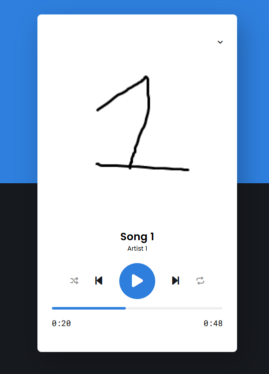

# Music Player



A simple client-side music player built with HTML, CSS and JavaScript. This small project demonstrates loading local audio files, basic player controls and a clean UI.

## Features

- Play / Pause
- Next / Previous track
- Seek using progress bar
- Track list with thumbnails
- Uses local static audio files (no backend required)

## Project structure

- `index.html` — main page and player UI
- `style.css` — layout and styling
- `script.js` — player logic and event handling
- `music-player.png` — project image/thumbnail
- `static/` — static assets used by the player:
  - `1.png`, `2.png`, `3.png` — track thumbnails
  - `Song-1.ogg`, `Song-2.ogg`, `Song-3.ogg` — audio files

## How to run

1. Clone or download the repository.
2. Open `index.html` in your browser (double-click or use "Open with" in your editor). No server or install required because it is pure frontend.

Notes for Chrome/Edge: If the audio files don't play when opening the file directly, serve the folder with a simple static server (example using Python):

```powershell
# from the project folder
python -m http.server 8000
# then open http://localhost:8000 in your browser
```

## Controls

- Play / Pause — toggle playback of the current track
- Next / Previous — move between tracks in the list
- Progress bar — click to seek inside the current track

## Development notes

- The player is implemented entirely in `script.js`. You can add or replace tracks by putting audio files in the `static/` folder and adjusting any arrays or references inside `script.js` if necessary.

## License & Author

This project is provided as-is. Feel free to use and modify it for learning and personal projects.

Author: BeterMain
